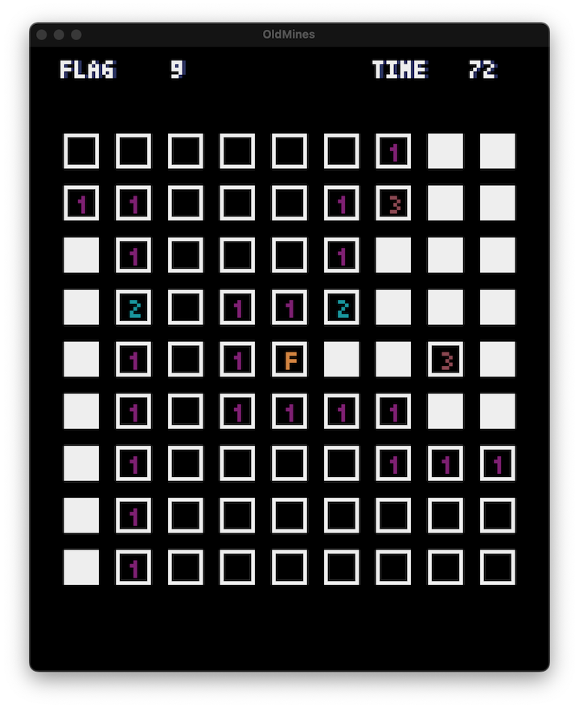

# Oldmines

A Minesweeper clone made using [Pyxel](https://github.com/kitao/pyxel). My goal is to create a
retro atmosphere, very much a work in progress at this point.

> [!NOTE]  
> Install requirements using `requirements.txt` and run `oldmines.py`.

Bugs? Create an issue, or submit a PR.

© Abhishek Basu, 2024.
